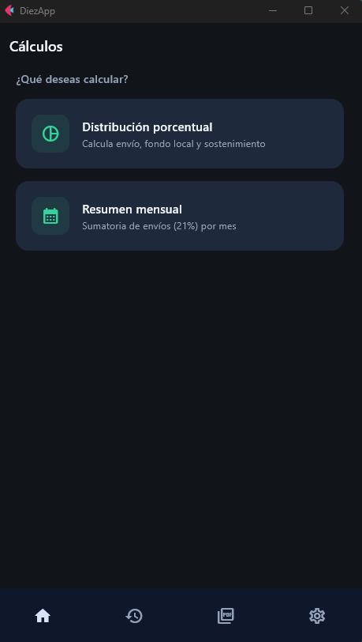
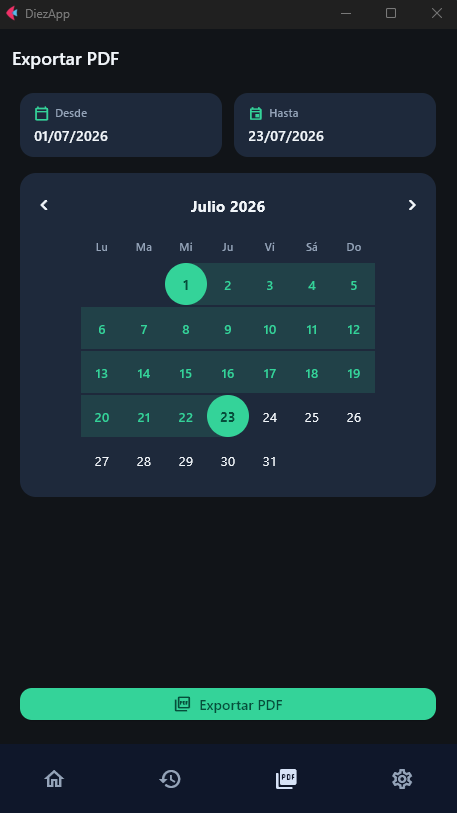

# DiezApp

Una calculadora local de diezmos hecha con Flet para cálculos porcentuales, resumen mensual, historial guardado y exportación a PDF.

## Qué hace

- Calcula la distribución del 21% a partir de un monto neto.
- Divide el resto entre fondo local y sostenimiento.
- Guarda los cálculos localmente con fecha y hora.
- Muestra totales mensuales y desgloses detallados.
- Exporta cálculos filtrados a PDF.
- Permite cambiar entre tema claro y oscuro.
- Guarda todo en archivos JSON locales, sin necesidad de backend.

## Vista previa

La app usa dos capturas verticales. La primera muestra la pantalla de inicio y la segunda el flujo de exportación a PDF.

<div style="display:flex; justify-content:center; gap:32px; flex-wrap:wrap; align-items:flex-start;">
  
  
</div>

## Tecnologías

- Python 3.12+
- Flet 0.85.3
- fpdf2 para generar PDF
- Almacenamiento local en JSON

## Inicio rápido

```bash
pip install flet fpdf2
flet run src/main.py
```

## Funcionalidades

- Calculadora principal para distribuir montos netos.
- Historial guardado con opciones para editar y eliminar.
- Resumen mensual con acumulado del 21%.
- Exportación a PDF por rango de fechas.
- Configuración de tema y porcentaje del fondo local.
- Navegación adaptable con barra inferior y barras superiores.

## Estructura del proyecto

```text
src/
  main.py
  settings.json
  saved_calculations.json
  assets/
  utils/
    pdf_export.py
    storage.py
    theme.py
  views/
    monthly_summary_view.py
    saved_calculations_view.py
    settings_view.py
```

## Datos locales

- [src/settings.json](src/settings.json) guarda el tema seleccionado y el porcentaje del fondo local.

## Notas

- La app está pensada para uso local y no requiere base de datos.
- Los PDF se generan en una ubicación temporal antes de compartirse.
- La compilación para Android está configurada para `arm64-v8a` y mantener el APK más ligero.

## Licencia

Apache 2.0. Ver [LICENSE](LICENSE) para más detalles.
