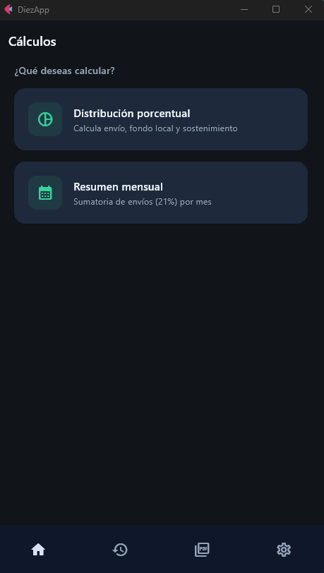
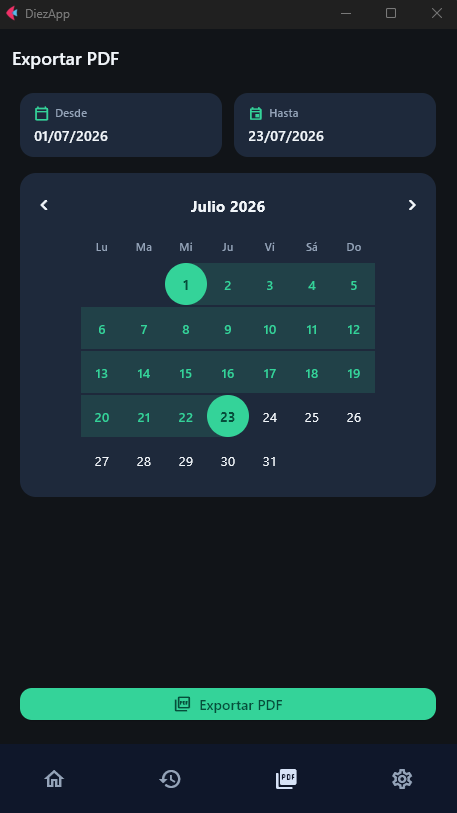

# DiezApp

Una calculadora local de diezmos hecha con Flet para cálculos porcentuales, resumen mensual, historial guardado y exportación a PDF.

## Qué hace

- Calcula la distribución del 21% a partir de un monto neto.
- Divide el resto entre fondo local y sostenimiento.
- Guarda los cálculos localmente con fecha y hora.
- Muestra totales mensuales y desgloses detallados.
- Exporta cálculos filtrados a PDF.
- Permite cambiar entre tema claro y oscuro.
- Guarda los datos localmente en SQLite, sin necesidad de backend.

## Vista previa

La app usa dos capturas verticales. La primera muestra la pantalla de inicio y la segunda el flujo de exportación a PDF.

<div style="display:flex; justify-content:center; gap:32px; flex-wrap:wrap; align-items:flex-start;">
  
  
</div>

## Tecnologías

- Python 3.14+
- Flet 1.0.4+
- fpdf2 para generar PDF
- Almacenamiento local en SQLite

## Inicio rápido

```bash
uv sync
flet debug windows      # o: flet debug android (con el móvil conectado)
```

El editor de notas es una extensión de Flutter propia
([packages/flet-note-editor](packages/flet-note-editor), basada en
`flutter_quill`). Flet solo compila extensiones con `flet debug` y
`flet build`, así que con `flet run` la app arranca pero la pantalla de una
nota no puede mostrarse. La primera compilación descarga Flutter y tarda unos
minutos; en Windows necesita Visual Studio (o Build Tools) con C++.

## Funcionalidades

- Calculadora principal para distribuir montos netos.
- Historial guardado con opciones para editar y eliminar.
- Resumen mensual con acumulado del 21%.
- Exportación a PDF por rango de fechas.
- Configuración de tema y porcentaje del fondo local.
- Navegación adaptable con barra inferior y barras superiores.

## Estructura del proyecto

```text
src/
  main.py
  assets/
  diezapp/
    bootstrap/
    navigation/
    features/
      calculator/
      calculations/
      conflicts/
      google_drive/
      local_backup/
      monthly_summary/
      notes/
      pdf_export/
      settings/
    infrastructure/
      database/
      files/
      google/
      pdf/
    shared/
```

## Datos locales

- La base de datos local `app.db` conserva cálculos, notas, ajustes, conflictos y el historial de backups.

## Notas

- La app está pensada para uso local y no requiere backend.
- Los PDF se generan en una ubicación temporal antes de compartirse.
- La compilación para Android está configurada para `arm64-v8a` y mantener el APK más ligero.

## Licencia

Apache 2.0. Ver [LICENSE](LICENSE) para más detalles.
